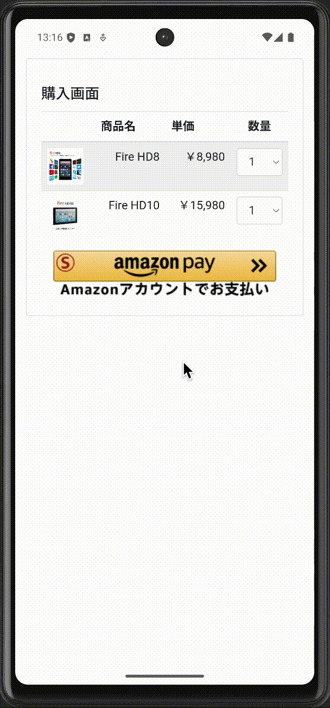
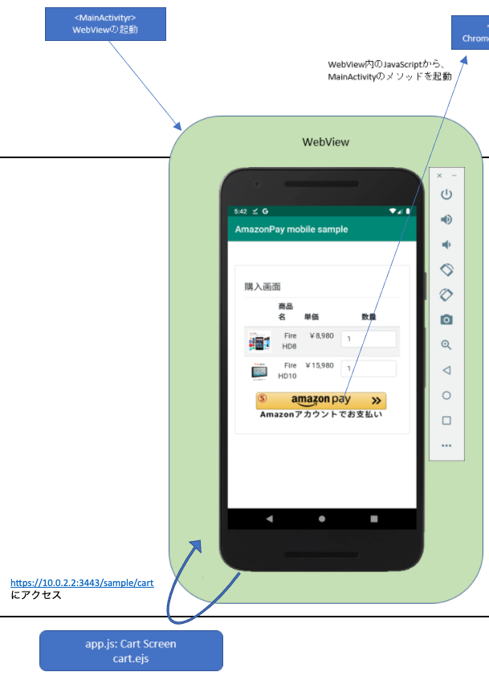
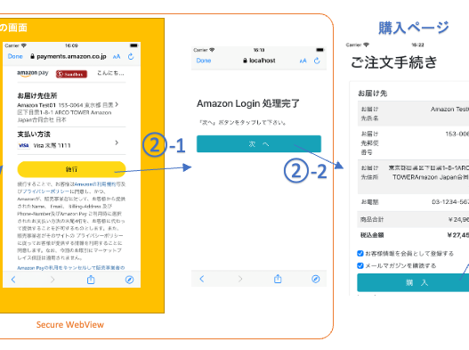
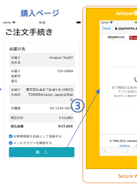
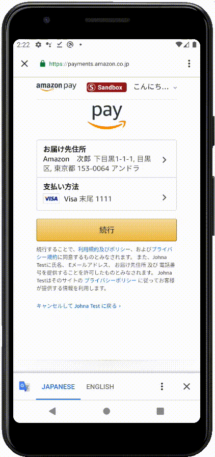

# Amazon Pay モバイル サンプルアプリ Android編
GMO Payment Gateway Amazon Pay cPSP の2ステップ決済機能を使用したモバイルサンプルアプリの、Androidアプリ側の実装です。インストールして動作させる方法については、[こちら](./README_install.md)をご参照下さい。

# 動作環境
Android 9以降: Google Chrome 78以降  
[参考] https://pay.amazon.com/jp/help/202030010

# その他の前提条件
本サンプルアプリではApplinksという技術を使っており、こちらを利用するためには下記の条件が必要です。
 - Web上のhttpsで正しくアクセスできる場所に設定ファイルを配置する必要があるので、ECサイトとは別ドメインのサーバーか、AWS等のクラウドサービスのアカウントを保有していること  
   Note: 本サンプルアプリでは、[Amazon S3](https://aws.amazon.com/jp/s3/)を利用しています。こちらはアカウントをInternet上で簡単に取得でき、世界中で広く使われており、利用方法などの情報も多く、12ヶ月間 5GBの無料利用枠もあるため、お勧めです。  

本サンプルアプリではUniversal Linksという技術を使っており、こちらを利用するためには下記の条件が必要です。
 - [Apple Developer Program](https://developer.apple.com/jp/programs/)に登録していること 
 - Web上のhttpsで正しくアクセスできる場所に設定ファイルを配置する必要があるので、ECサイトとは別ドメインのサーバーか、AWS等のクラウドサービスのアカウントを保有していること  
   Note: 本サンプルアプリでは、[Amazon S3](https://aws.amazon.com/jp/s3/)を利用しています。  

# 概要
本サンプルアプリは、下記動画のように動作いたします。

  

以後詳細な実装方法について解説します。

# Amazon Payの実装方法

## 設定

### AndroidManifest.xmlの設定

Secure WebView(Chrome Custom Tabs)のOpenとClose処理を担当する、AmazonPayActivityでは、下記のようにlaunchModeに「singleTask」を指定します。  

```xml
        <activity android:name=".AmazonPayActivity"
            android:launchMode="singleTask">
```

この指定を行うと、AmazonPayActivityの起動により自動的にSecure WebView(Chrome Custom Tabs)がCloseするようになります。  
Chrome Custom Tabsは直接プログラムからCloseする手段がないため、Closeしたいときには代わりにAmazonPayActivityを起動して対応します。  

### モバイルアプリのJavaScript側からのCallback受付の設定
モバイルアプリではAmazon Payの処理はSecure WebView上で実行する必要がありますが、WebViewから直接Secure WebViewは起動できないため、WebViewのJavaScriptから一旦Nativeコードを起動できるよう設定する必要があります。  
それを行うのが下記のコードです。  

```swift
// MainActivity.javaから抜粋 (見やすくするため、一部加工しています。)

    protected void onCreate(Bundle savedInstanceState) {
                :
        webView.addJavascriptInterface(this, "androidApp");
                :
    }
                :
    @JavascriptInterface
    public void startSecureWebview() {
                :
    }
                :
```

このように設定すると、下記のようにJavaScript側からNative側にメッセージを送信することが可能になります。
```js
                androidApp.startSecureWebview();
```

## カートページ

  

### カートページ表示

モバイルアプリを起動すると、下記コードによりWebView上で`http://localhost:3080/cart` へリクエストが送信されます。  

```java
// MainActivity.javaから抜粋 (見やすくするため、一部加工しています。)

            :
        myWebView = findViewById(R.id.webview);
            :
        myWebView.addJavascriptInterface(this, "androidApp");
        myWebView.loadUrl("http://10.0.2.2:3080/cart");
            :
```

これにより、nodejsサーバーにて下記が実行されます。  

```js
// app.jsから抜粋 (見やすくするため、一部加工しています。)

//-------------------
// Cart Page
//-------------------
app.get('/cart', async (req, res) => {
    res.render ('cart.ejs');
});
```

これにより、`/nodejs/views/cart.ejs`のテンプレートが読み込まれて、cartページが描画されます。  

### クライアント判定
本サンプルアプリでは、同一のHTML/JavaScriptの画面でAndroid/iOS/通常のBrowserの全てに対応しております。  
そのため、動作環境に応じて処理を切り替える必要がある場合には、クライアントを判定して条件分岐を行う必要があります。  
それを行っているのが、下記のJavaScriptのコードです。

```js
// nodejs/views/sample/cart.ejsより抜粋

    let client = "browser";
    if(window.androidApp) {
        client = "androidApp";
    } else if(window.webkit && webkit.messageHandlers && webkit.messageHandlers.iosApp) {
        client = "iosApp";
    }
    document.cookie = "client=" + client + ";path=/"; // ここではテストのため、localhostへはhttpでアクセスするため、secure属性を付与しない。
```

上記「モバイルアプリのJavaScript側からのCallback受付の設定」で設定されたCallback用のObjectの存在確認を行うことで、それぞれ何の環境なのかを判定しています。  
判定結果はServer側でも参照できるよう、Cookieに設定しています。  

### 「Amazon Payボタン」画像の配置

Amamzon Payで支払いができることをユーザに視覚的に伝えるのには、Amazon Payボタンを画面に表示するのが効果的です。  
WebView上では本物のAmazon Payボタンを配置できないので、ここでは画像を代わりに配置しています。

それを行っているのが、下記のJavaScriptです。
```js
// nodejs/views/sample/cart.ejsより抜粋 (見やすくするため、一部加工しています。)

    if(client === 'browser') {
        amazon.Pay.renderButton('#AmazonPayButton', {
            :
        });
    } else {
        let node = document.createElement("input");
        node.type = "image";
        node.src = "/static/img/button_images/Gold/Sandbox-ja_jp-amazonpay-gold-large-button_T2.png";
        node.style.width = "90%";
        node.addEventListener('click', (e) => {
            coverScreen();
            if(client === 'androidApp') {
                androidApp.startSecureWebview();
            } else {
                    :
            }
        });
        document.getElementById("AmazonPayButton").appendChild(node);
    }
```

最初の判定で、通常のBrowserだった場合にはそのままAmazon Payの処理が実施できるので、通常通りAmazon Payボタンを読み込んでいます。  
Androidの場合は、「Amazon Payボタン」画像のnodeを生成して同画面内の「AmazonPayButton」ノードの下に追加しています。  
この時指定する「Amazon Payボタン」画像は「./nodejs/static/img/button_images」の下にあるものから選ぶようにして下さい。なお、本番環境向けにファイル名が「Sandbox_」で始まるものを指定しないよう、ご注意下さい。  
またaddEventListenerにより、ボタン画像がclickされたときにNative側のCallbackの「androidApp」を通じて「startSecureWebview」を呼び出します。  

### 「Amazon Payボタン」画像クリック時の、Secure WebViewの起動処理
上記、「Amazon Payボタン」画像がクリックされたときに呼び出されるNative側のコードが、下記になります。  

```java
// MainActivity.javaから抜粋 (見やすくするため、一部加工しています。)

public class MainActivity extends AppCompatActivity {
    static volatile String secureToken = null;
            :
    @JavascriptInterface
    public void startSecureWebview() {
        secureToken = UUID.randomUUID().toString();
        Log.d("[JsCallback - start]", "secureToken=" + secureToken);
        invokeSecureWebview(this, "https://10.0.2.2:3443/startSecureWebview?client=androidApp&secureToken=" + secureToken);
    }
            :
    private void invokeSecureWebview(Context context, String url) {
        Intent intent = new Intent(context, AmazonPayActivity.class);
        intent.putExtra("url", url);
        context.startActivity(intent);
    }
}
```

URLを指定して、invokeSecureWebviewメソッドを呼び出し、その「invokeSecureWebview」の中でAmazonPayActivityにIntentを送信しています。  
Note: ここでは自分のアプリのコンポーネントの起動のために[明示的インテント](https://developer.android.com/guide/components/intents-filters?hl=ja#Types)を利用しており、[こちら](./README_swv2app.md)で解説されているようなSecurity上の懸念はありません。  
これにより、AmazonPayActivityが起動されます。  
Note: なお、UUID(version 4)を生成して「secureToken」という名前で、Native側のFieldと起動するURLのパラメタとして設定しています。これは後続の処理で特定のページやアプリへの遷移の妥当性をチェックするために利用します。  


起動されたAmazonPayActivity側の処理が下記です。  
URLを指定して、Chrome Custom Tabs(Android側のSecure WebView)を起動しているのが分かると思います。  

```java
// AmazonPayActivity.javaから抜粋 (見やすくするため、一部加工しています。)
                :
public class AmazonPayActivity extends AppCompatActivity {
                :
    @Override
    protected void onCreate(Bundle savedInstanceState) {
                :
        Intent intent = getIntent();
        Log.d("[Intent]", "Explicit intent received!");
        String url = intent.getStringExtra("url");
        Log.d("[Intent - url]", url);
        invokeSecureWebview(this, url);
    }
                :
    private void invokeSecureWebview(Context context, String url) {
        CustomTabsIntent tabsIntent = new CustomTabsIntent.Builder().build();

        // 起動するBrowserにChromeを指定
        // Note: Amazon Payでは他のブラウザがサポート対象に入っていないため、ここではChromeを指定している.
        // [参考] https://pay.amazon.com/jp/help/202030010
        // もしその他のChrome Custom Tabs対応のブラウザを起動する必要がある場合には、下記リンク先ソースなどを参考に実装する.
        // [参考] https://github.com/GoogleChrome/custom-tabs-client/blob/master/shared/src/main/java/org/chromium/customtabsclient/shared/CustomTabsHelper.java#L64
        tabsIntent.intent.setPackage("com.android.chrome");

        // Chrome Custom Tabsの起動
        tabsIntent.launchUrl(context, Uri.parse(url));
    }
}
```

## Amazonログイン画面への自動遷移

指定されたURLで開くページにて、「initCheckout」というメソッドをJavaScriptでcallすることで、Amazonログイン画面に遷移させています。  

### ページの描画

Secure WebView上で`https://10.0.2.2:3443/startSecureWebview?client=androidApp&secureToken=xxxx`へのリクエストが送信されると、nodejs側で下記が呼び出されます。  

```js
// nodejs/app.jsより抜粋 (見やすくするため、一部加工しています。)

//------------------------------------------------
// Start Secure WebView Page (Only for MobileApp)
//------------------------------------------------
app.get('/startSecureWebview', async (req, res) => {
    res.render (
        'startSecureWebview.ejs', 
        {client: req.query.client}
    );
});
```

`req.query.client`はURLパラメタの「client」を表しており、この場合は指定された「androidApp」が値となります。これをパラメタとして、`/nodejs/views/startSecureWebview.ejs`のテンプレートが読み込まれてページが描画され、下記スクリプトが実行されます。  

```js
// nodejs/views/sample/startSecureWebview.ejsより抜粋 (見やすくするため、一部加工しています。)

    document.cookie = `secureToken=${getURLParameter('secureToken', location.search)}; path=/;` // CookieにsecureTokenを保存

    amazon.Pay.initCheckout({
                    :
        // configure Create Checkout Session request
        createCheckoutSessionConfig: {                     
<% if (client === 'iosApp') { // iOS・Android間でSimulatorからのHost OSのlocalhostの表現方法の違いを吸収するための分岐。本番や検証サーバーではこの分岐は必要ない。 %>
                    :
<% } else { %>
            payloadJSON: '{"webCheckoutDetails":....', // string generated in step 2
            signature: 'UgdQh8K1QY5....', // signature generated in step 3
<% } %>
            publicKeyId: 'SANDBOX-AGH2Y6VC2VAUJ27GG6VDFOTD',
            algorithm: 'AMZN-PAY-RSASSA-PSS-V2'
        }
    });
```
※ <% 〜 %>で囲まれた部分はサーバー側でテンプレートとして実行される部分で、この場合はパラメタ「client」の値として「androidApp」が渡されているため、「else」より後の括弧内が描画されます。  

こちらのスクリプトにより、cookieにURLパラメタ「secureToken」として渡された値が設定された後、initCheckoutが実行されてAmazon Payのログイン画面に自動遷移します。  

### Code GeneratorによるinitCheckoutスクリプトの生成方法

initCheckoutの呼び出し処理のスクリプトはパラメタの正当性を担保するためのsignatureを計算して渡す必要があるなど、仕様が少々複雑です。
しかし、[Code Generator](https://www.amazonpay-integration.com/v2/code-generator/signature-generator.html?processorSpecifications=gmopg)というツールを使うことで簡単に生成できます。  
※ GMOPGの管理ページでもスクリプトの生成はできますが、一部対応していないAmazon Payの機能があるため、本サンプル用のスクリプトの生成ができません。よって、ここでは[Code Generator](https://www.amazonpay-integration.com/v2/code-generator/signature-generator.html?processorSpecifications=gmopg)をお使いください。  

[Code Generator](https://www.amazonpay-integration.com/v2/code-generator/signature-generator.html?processorSpecifications=gmopg)にアクセスすると、下記のようなページが開きます。  

  

それぞれ下記のように入力します。  
- MerchantId - SellerCentralより取得した出品者ID(参考: https://www.amazonpay-faq.jp/faq/QA-7 )
- Type - 実装したいAmazon Payの機能に応じて選択。本サンプルでは「Onetime」を選択する。
- Store ID - SellerCentralより取得したStore ID(参考: https://www.amazonpay-faq.jp/faq/QA-7 )
- Public Key Id - SellerCentralより取得したPublic Key Id(参考: https://www.amazonpay-faq.jp/faq/QA-59 )
- Checkout Review ReturnUrl - Amazon Payで住所・支払方法選択後にリダイレクトされるURLで、通常Review画面へのURL. 本サンプルアプリ(Android)では「https://10.0.2.2:3443/static/pauseSecureWebview.html 」。
- Private Key - SellerCentralより取得したPrivate Key(参考: https://www.amazonpay-faq.jp/faq/QA-59 )。ブラウザにUploadして使用するが、Code GeneratorではPrivate Keyはブラウザ内でしか利用せず、一切他のサーバー等には送信しないため、漏洩の心配はない。
- Product Type - 実装したいAmazon Payの機能に応じて選択。本サンプルでは「PayAndShip」を選択する。
- Scopes - Amazon Payから取得する必要のあるユーザの情報に応じて指定。本サンプルではデフォルトのままで良い。
- Checkout Cancel Url - Amazon Pay側の画面上でCancelした場合にリダイレクトされるURL。詳細は後述の「Amazon側ページ上でのCancel処理」参照。本サンプルアプリ(Android)では「https://10.0.2.2:3443/static/cancelSecureWebview.html?client=androidApp 」。
- Sandbox - 本サンプルアプリはSandbox環境で動作させるため、「true」。本番向けには「false」を選択すること。

入力したら、「Generate Button Code Sample」ボタンをクリックします。  

  

Resultの「Code Sample」には下記のようにAmazon Payボタンを描画するためのスクリプトが出力されます。  

```html
<!-- 見やすくするため、一部加工しています。-->

<div id="AmazonPayButton"></div>
<script src="https://static-fe.payments-amazon.com/checkout.js"></script>
<script type="text/javascript" charset="utf-8">
amazon.Pay.renderButton('#AmazonPayButton', {
    // set checkout environment
    merchantId: 'A23YM23UEBY8FM',
    ledgerCurrency: 'JPY',
    // customize the buyer experience
    checkoutLanguage: 'ja_JP',
    productType: 'PayAndShip',
    placement: 'Other',
    sandbox: true,
    buttonColor: 'Gold',
    // configure Create Checkout Session request
    createCheckoutSessionConfig: {                     
        payloadJSON: '{"webCheckoutDetails":....',
        signature: 'UgdQh8K1QY5....',
        publicKeyId: 'SANDBOX-AGH2Y6VC2VAUJ27GG6VDFOTD',
        algorithm: 'AMZN-PAY-RSASSA-PSS-V2'
    }
});
</script>
```

これをinitCheckoutのスクリプトに変更します。実施する内容は下記の通り、呼び出すメソッドを「initCheckout」変更すること、ボタンにのみ関係する部分を除去することだけです。  

```html
<!-- 見やすくするため、一部加工しています。-->

<!-- 除去: div id="AmazonPayButton"></div -->
<script src="https://static-fe.payments-amazon.com/checkout.js"></script>
<script type="text/javascript" charset="utf-8">
// この行は↓に変更: amazon.Pay.renderButton('#AmazonPayButton', {
amazon.Pay.initCheckout({  // ← メソッド名を「initCheckout」に変更 & Amazon Payボタンのnode指定のパラメタの除去
    // set checkout environment
    merchantId: 'A23YM23UEBY8FM',
    ledgerCurrency: 'JPY',
    // customize the buyer experience
    checkoutLanguage: 'ja_JP',
    productType: 'PayAndShip',
    placement: 'Other',
    sandbox: true,
    // 除去: buttonColor: 'Gold',
    // configure Create Checkout Session request
    createCheckoutSessionConfig: {                     
        payloadJSON: '{"webCheckoutDetails":....',
        signature: 'UgdQh8K1QY5....',
        publicKeyId: 'SANDBOX-AGH2Y6VC2VAUJ27GG6VDFOTD',
        algorithm: 'AMZN-PAY-RSASSA-PSS-V2'
    }
});
</script>
```

最終的には下記のようになるので、これをソースコードにコピペすれば完了です。  

```html
<!-- 見やすくするため、一部加工しています。-->

<script src="https://static-fe.payments-amazon.com/checkout.js"></script>
<script type="text/javascript" charset="utf-8">
amazon.Pay.initCheckout({
    // set checkout environment
    merchantId: 'A23YM23UEBY8FM',
    ledgerCurrency: 'JPY',
    // customize the buyer experience
    checkoutLanguage: 'ja_JP',
    productType: 'PayAndShip',
    placement: 'Other',
    sandbox: true,
    // configure Create Checkout Session request
    createCheckoutSessionConfig: {                     
        payloadJSON: '{"webCheckoutDetails":...',
        signature: 'Fmg886mF4xY6N4qArA...',
        publicKeyId: 'SANDBOX-AGH2Y6VC2VAUJ27GG6VDFOTD',
        algorithm: 'AMZN-PAY-RSASSA-PSS-V2'
    }
});
</script>
```

## Secure WebView上の処理を中断してアプリに戻り、WebViewで購入ページを表示

  

### checkoutReviewReturnUrlへのリダイレクト
Amazon Payのページにて住所・支払方法を選択し、「続行」ボタンを押下すると、initCheckoutでCheckout Review ReturnUrlに指定した「https://10.0.2.2:3443/static/pauseSecureWebview.html 」に対してURLパラメタ`amazonCheckoutSessionId`が付与されたURLへのリダイレクトが実行されます。  
これにより、`nodejs/static/pauseSecureWebview.html`が描画されます。  

```html
// nodejs/static/pauseSecureWebview.htmlより抜粋 (見やすくするため、一部加工しています。)

        :
    <a id="nextButton" href="#" class="btn btn-info btn-lg btn-block">
        次　へ
    </a>
        :
<script>
    document.getElementById("nextButton").href = 
        "https://dzpmbh5sopa6k.cloudfront.net/index.html" 
            + location.search + '&'
            + document.cookie.split('; ').find(function(kv) {return kv.startsWith('secureToken=')}); // CookieよりsecureTokenを取得
</script>
        :
```

画面上に「次へ」ボタンのあるページが表示されます。  
スクリプトにより、この「次へ」ボタンにアプリを起動するApplinksのURLを指定しています。  
※ Applinksについての詳細については、[こちら](./README_swv2app.md)に記載しております。  
また、アプリにURLパラメタとして渡すため、下記をそれぞれ付与しています。  
- 「location.search」を通じてamazonCheckoutSessionId
- Cookieに保存されているsecureToken

これにより、「次へ」ボタンが押下されるとApplinksが発動し、アプリのNativeコードが起動されます。  

### tokenチェックとViewControllerへの遷移先URLの設定
Applinksにより起動されるNaiveコードは、下記になります。  

```java
// AmazonPayActivity.javaから抜粋 (見やすくするため、一部加工しています。)
                    :
    protected void onNewIntent(Intent intent) {
                    :
        if (intent.getScheme().equals("https")) {
            String appLinkAction = intent.getAction();
            Uri appLinkData = intent.getData();
            Log.d("[AppLink]", appLinkAction);
            Log.d("[AppLink]", "" + appLinkData);

            // URLパラメタのパース
            Map<String, String> map = new HashMap<>();
            for (String kEqV : appLinkData.getEncodedQuery().split("&")) {
                String[] kv = kEqV.split("=");
                map.put(kv[0], kv[1]);
            }

            Log.d("[AppLink]", "secureToken: app=" + MainActivity.secureToken + ", url=" + map.get("secureToken"));
            if (MainActivity.secureToken.equals(map.get("secureToken"))) { // secureTokenの一致判定
                // 一致した場合には、購入ページのURLをMainActivityに設定
                MainActivity.webviewUrl = "/review?amazonCheckoutSessionId=" + map.get("amazonCheckoutSessionId");
            } else {
                // 不一致の場合には不正な遷移であるため、エラーページを設定
                MainActivity.webviewUrl = "/static/sample/error.html";
            }
        } else {
                    :
        }

        // 本Activityのfinish. (この後、MainActivity#onResumeに処理が移る)
        this.finish();
    }
```
※ 本サンプルではAmazonPayActivityが「singleTask」に設定されており、それによりSecure WebView(Chrome Custom Tabs)はAmazonPayActivityの起動により自動的にCloseされます。  

最初に、Applinks発動のURLに指定されていたURLパラメタを取得します。  

その後、「『Amazon Payボタン』画像クリック時の、Secure WebViewの起動処理」でMainActivityに保持したsecureTokenと、Secure WebViewから受け渡されたsecureTokenの一致判定を行っています。  
このsecureTokenの判定を行うことで、不正な遷移でこの処理が起動された場合に、それを検出してエラーとできるようになります。  

secureTokenチェックの後は、購入ページのURLをMainActivityに設定します。  
購入ページのURLには「amazonCheckoutSessionId」をURLパラメタを付与しますが、これはPC・Mobileのブラウザでの購入ページへの遷移と全く同じURL・全く同じ条件になります。  
よって、この後の購入ページの表示では「モバイルアプリ向け」「PC・Mobileのブラウザ向け」で別々の処理を実装する必要はありません。  

最後に、AmazonPayActivityをfinishします。これにより、すぐ下のMainActivity#onResume処理が移ります。  

### 購入ページの読み込み

MainActivityでは、onResumeの中の下記の処理が起動します。  

```java
// MainActivity.javaより抜粋　(見やすくするため、一部加工しています。)

                    :
public class MainActivity extends AppCompatActivity {
                    :
    static volatile String webviewUrl = null;
                    :
    protected void onResume() {
                    :
        String url = webviewUrl;
                     :
        webviewUrl = webviewParams = null;
       if (url != null) {
            myWebView.loadUrl("javascript:loadUrl('" + url + "')");
                    :
```

WebViewではこの時点でカートページが表示されており、上記にて下記のJavaScriptが起動して購入ページの読み込みが開始します。  

```js
// nodejs/views/sample/cart.ejsより抜粋 (見やすくするため、一部加工しています。)

    function loadUrl(url) {
        location.href = url;
    }
```

Server側では下記が実行されます。

```js
// nodejs/app.jsより抜粋 (見やすくするため、一部加工しています。)

//-------------------------
// Review Page
//-------------------------
app.get('/review', async (req, res) => {
    try {
        // 受注情報
        let order = {amazonCheckoutSessionId: req.query.amazonCheckoutSessionId,
            client: req.cookies.client, hd8: req.cookies.hd8, hd10: req.cookies.hd10, items: []};
        console.log(`AmazonCheckoutSessionID: ${order.amazonCheckoutSessionId}`);
        order.items.push({id: 'item0008', name: 'Fire HD8', price: 8980, num: parseInt(order.hd8)});
        order.items.push({id: 'item0010', name: 'Fire HD10', price: 15980, num: parseInt(order.hd10)});
        order.items.forEach(item => item.summary = item.price * item.num); // 小計
        order.price = order.items.map(item => item.summary).reduce((pre, cur) => pre + cur); // 合計金額
        order.chargeAmount = Math.floor(order.price * 1.1); // 税込金額

        // Amazon Pay受注情報
        const address = await callAPI('SearchAddressAmazonpay', 
            {AmazonCheckoutSessionID: order.amazonCheckoutSessionId, ...keyinfo});
        order.address = address;

        // Note: 一般的には受注情報はSessionやDBなどを使ってServer側に保持しますが、本サンプルではシンプルにするためにCookieを使用しています
        res.cookie('session', JSON.stringify(order), {secure: false}); // ここではテストのため、localhostへはhttpでアクセスするため、secure属性を付与しない。
        
        res.render('review.ejs', order);
    } catch (err) {
        console.error(err);
        res.redirect('/static/sample/error.html');
    }
});
```

cartの情報を計算して金額を出し、またGMOPG APIより住所情報等を取得し、`review.ejs`に渡してページを描画します。

## 購入ボタンクリック時の処理

  

### Ajaxでのサーバー側トランザクション実行処理呼び出し

購入ボタンをクリックすると、下記のScriptが実行されます。

```js
// nodejs/views/review.ejsより抜粋 (見やすくするため、一部加工しています。)

            :
    //-------------
    // 購入ボタン
    //-------------
    document.getElementById("purchaseButton").addEventListener('click', (e) => {
        $.ajax({
            type: 'POST',
            url: '/checkoutSession',
            data: {},
        })
        .then(
            :
```

Ajaxにより、下記のServer側の処理が呼び出されます。  

```js
// nodejs/app.jsより抜粋 (見やすくするため、一部加工しています。)

//-------------------------------
// Checkout Session Update API
//-------------------------------
app.post('/checkoutSession', async (req, res) => {
    try {
        const order = JSON.parse(req.cookies.session);
        order.id = crypto.randomBytes(13).toString('hex');
        console.log(`OrderID: ${order.id}`);

        order.access = await callAPI('EntryTranAmazonpay', {
            ...keyinfo,
            OrderID: order.id,
            JobCd: 'AUTH',
            Amount: `${order.chargeAmount}`,
            AmazonpayType: '4',
        });

        const url = order.client === 'browser' ? "https://localhost:3443/thanks" :
            `https://${order.client === 'iosApp' ? 'localhost' : '10.0.2.2'}:3443/endSecureWebview?client=${order.client}`;
        order.start = await callAPI('ExecTranAmazonpay', {
            ...keyinfo,
            ...order.access,
            OrderID: order.id,
            RetURL: url,
            AmazonCheckoutSessionID: order.amazonCheckoutSessionId,
            Description: "ご購入ありがとうございます。",
        });

        // Note: 一般的には受注情報はSessionやDBなどを使ってServer側に保持しますが、本サンプルではシンプルにするためにCookieを使用しています
        res.cookie('session', JSON.stringify(order), {secure: false});

        // ExecTranAmazonpayの戻り値のObjectを、"key1=value1&key2=value2..."の形式に変換
        const params = Object.keys(order.start).map(k => `${k}=${encodeURIComponent(order.start[k])}`).join('&');

        res.writeHead(200, {'Content-Type': 'application/json; charset=UTF-8'});
        res.write(JSON.stringify({params}));
    } catch (err) {
        console.error(err);
        res.writeHead(500, {'Content-Type': 'application/json; charset=UTF-8'});
    }
    res.end()
});
```

GMOPG APIを使って、決済に必要な購入金額や事業者側の受注番号等の情報と、支払い処理ページ(後述)で自動的にリダイレクトされるURL等を登録してトランザクションの実行を処理します。  
この、「支払い処理ページで自動的にリダイレクトされるURL」ですが、Browserの場合は直接ThanksページのURLを、iOS及びAndroidの場合は中継用ページ(後述)へのURL(https://10.0.2.2:3443/endSecureWebview?client=androidApp)を、それぞれ指定します。  
GMOPG APIからの戻り値は、"key1=value1&key2=value2..."の形式に変換してResponseとして返却します。  

### 再度Secure WebViewを起動

AjaxのResponseが返ってくると、下記が実行されます。

```js
// nodejs/views/review.ejsより抜粋 (見やすくするため、一部加工しています。)

            :
    document.getElementById("purchaseButton").addEventListener('click', (e) => {
        $.ajax({
            :
        })
        .then(
            function(json) { //success
                console.log(json);
                if(json.params) {
                    if(window.androidApp) {
                        coverScreen();
                        androidApp.resumeSecureWebview(json.params);
                    } else if(window.webkit && webkit.messageHandlers && webkit.messageHandlers.iosApp) {
                        :
                    } else {
                        :
                    }
                } else {
                    :
            },
                    :
        );
    });
```

WebViewに渡されたCallback Objectの存在チェックにより、クライアントの環境を判定して対応する処理を実行します。  
今回はAndroidなので、下記が実行されます。

```js
                        androidApp.resumeSecureWebview(json.params);
```

これにより、Responseに含まれていた値をパラメタとして、Native側の下記「resumeSecureWebview」が実行されます。  

```java
// MainActivity.javaより抜粋　(見やすくするため、一部加工しています。)

                    :
    @JavascriptInterface
    public void resumeSecureWebview(String params) {
        Log.d("[JsCallback - resume]", "params: " + params + ", secureToken: " + secureToken);
        invokeSecureWebview(this, "https://10.0.2.2:3443/static/resumeSecureWebview.html?" + params + "&secureToken=" + secureToken);
    }
                    :
```
URLを指定して、invokeSecureWebviewメソッドを呼び出しています。「invokeSecureWebview」については『「Amazon Payボタン」画像クリック時の、Secure WebViewの起動処理』で既に説明済みですので、ここでは省略しますが、これにより「https://localhost:3443/static/resumeSecureWebview.html 」に下記をURLパラメタとして付与したURLでSecure WebViewを起動します。
- GMOPG APIのEntryTranAmazonpayの戻り値
- secureToken

## 支払い処理ページ

  

### 支払い処理ページへの遷移

resumeSecureWebview.htmlを開くと、下記のスクリプトが実行されます。  

```html
<!-- nodejs/static/resumeSecureWebview.htmlより抜粋 (見やすくするため、一部加工しています。) -->

                    :
    <form id="AmazonpayRedirectCall" method="POST">
        <input type="hidden" id="AccessID" name="AccessID">
        <input type="hidden" id="Token" name="Token">
    </form>
    
    <script>
                    :
            const arc = document.getElementById('AmazonpayRedirectCall');
            arc.action = getURLParameter("StartURL", location.search);
                    :
                document.getElementById('AccessID').value = getURLParameter("AccessID", location.search)
                document.getElementById('Token').value = getURLParameter("Token", location.search);
                arc.submit();
                    :
    </script>
                    :
```

GMOPG APIのEntryTranAmazonpayの戻り値として渡された、StartURLに対して、AccessID・TokenをパラメタとしてPOSTリクエストを送信します。  
※ 上記で省略した部分を確認すると分かりますが、実際にはOpen Redirector対策としてsecureTokenとdomainのチェックも合わせて実施しています。  
これにより、GMOPGのページを経由して、Amazon Payの支払い処理ページ(スピナーページとも呼ばれます)が表示されます。  
この画面が表示されている間、Amazon側ではServer側で与信を含む支払いの処理が行われており、エラーハンドリングも含めてこちらの画面で処理されています。  
支払いの処理が終わると、「Ajaxでのサーバー側トランザクション実行処理呼び出し」で指定した中継用ページへのURLに自動的にPOSTリクエストが送信されます。  

### 中継用ページ

中継用ページのURLは「https://10.0.2.2:3443/endSecureWebview?client=androidApp 」で、これによりnodejsの下記の処理が起動します。  

```js
// nodejs/app.jsより抜粋 (見やすくするため、一部加工しています。)

//------------------------------------------------
// End Secure WebView Page (Only for MobileApp)
//------------------------------------------------
app.post('/endSecureWebview', async (req, res) => {
    console.log(req.query.client);
    // Objectをkey1=value1&key2=value2...の形に変換する.
    const plainParams = Object.keys(req.body).map(k => `${k}=${encodeURIComponent(req.body[k])}`).join('&');
    const params = encodeURIComponent(plainParams);
    console.log(params);

    res.render('endSecureWebview.ejs', {client: req.query.client, params: params});
});
```

GMOPGからPOSTで送信されたパラメタを「key1=value1&key2=value2...」の形式に変換し、clientパラメタ(値: androidApp)と共にパラメタとして`endSecureWebview.ejs`に渡して描画します。  

```js
// nodejs/views/endSecureWebview.ejsより抜粋 (見やすくするため、一部加工しています。)
            :
<% if (client === 'iosApp') { %>
            :
<% } else { %>
        const appUri = `intent://amazon_pay_android_v2#Intent;package=com.example.myapp2;scheme=amazon_pay_android_v2;S.mode=thanks;S.params=<%= params %>;end;`;
<% } %>
        // 自動的にアプリに戻る
        location.href = appUri;
            :
```
※ <% 〜 %>で囲まれた部分はサーバー側でテンプレートとして実行される部分で、この場合はパラメタ「client」の値として「androidApp」が渡されているため、「else」より後の括弧内が描画されます。  

このスクリプトのより、GMOPGからPOSTで送信されたパラメタを付与されたIntent([暗黙的インテント](https://developer.android.com/guide/components/intents-filters?hl=ja#Types))が自動で発動し、アプリが呼び出されます。
※ Intentについての詳細は、[こちら](./README_swv2app.md)をご参照下さい。  

なお上記で省略されたスクリプトを確認すると分かりますが、実際にはアプリがBackground状態だと稀にIntentが発動しない場合があることを考慮し、自動で発動しなかった場合にIntentを発動させるボタンを補助的に表示するようにしています。  

## Thanksページ

  

### Intentより起動されるNativeの処理

上記Intentにより起動されるNativeの処理は、下記になります。

```java
// AmazonPayActivity.javaより抜粋　(見やすくするため、一部加工しています。)

                    :
    @Override
    protected void onNewIntent(Intent intent) {
                    :
        if (intent.getScheme().equals("https")) {
                    :
        } else {
            Log.d("[Intent]", "Implicit intent received!");
            Log.d("[Intent]", intent.getStringExtra("mode"));
            if(intent.getStringExtra("mode").equals("thanks")) { // Thanksページ表示
                String params = intent.getStringExtra("params");
                Log.d("[Intent]", params);
                MainActivity.webviewParams = params;
            } else { // Thanksページ表示
                    :
            }
        }

        // 本Activityのfinish. (この後、MainActivity#onResumeに処理が移る)
        this.finish();
    }
```

Intentにて取得したparmsをMainActivityに設定します。  
そして、AmazonPayActivityをfinishします。これにより、すぐ下のMainActivity#onResumeに処理が移ります。  

### Thanksページの読み込み

MainActivityでは、下記の処理が起動します。  

```java
// MainActivity.javaより抜粋　(見やすくするため、一部加工しています。)

                    :
    @Override
    protected void onResume() {
        super.onResume();
                    :
        String params = MainActivity.webviewParams;
        webviewUrl = webviewParams = null;
        if (url != null) {
                    :
        } else if(params != null) {
            myWebView.loadUrl("javascript:postToThanks('" + params + "')");
        } else {
                    :
        }
    }
                    :
```

WebViewではこの時点で購入ページが表示されており、上記にて下記のJavaScriptが起動してThanksページの読み込みが開始します。  

```html
<!-- nodejs/views/review.ejsより抜粋 (見やすくするため、一部加工しています。) -->

            :
<form id="AmazonpayThanksCall" action="/thanks" method="POST">
    <input type="hidden" id="ShopID" name="ShopID">
    <input type="hidden" id="OrderID" name="OrderID">
    <input type="hidden" id="Status" name="Status">
    <input type="hidden" id="TranDate" name="TranDate">
    <input type="hidden" id="AmazonChargePermissionID" name="AmazonChargePermissionID">
    <input type="hidden" id="CheckString" name="CheckString">
    <input type="hidden" id="ErrCode" name="ErrCode">
    <input type="hidden" id="ErrInfo" name="ErrInfo">
</form>
            :
<script type="text/javascript" charset="utf-8">
            :
    function postToThanks(params) {
        document.getElementById('ShopID').value = getParameter("ShopID", params)
        document.getElementById('OrderID').value = getParameter("OrderID", params)
        document.getElementById('Status').value = getParameter("Status", params)
        document.getElementById('TranDate').value = getParameter("TranDate", params)
        document.getElementById('AmazonChargePermissionID').value = getParameter("AmazonChargePermissionID", params)
        document.getElementById('CheckString').value = getParameter("CheckString", params)
        document.getElementById('ErrCode').value = getParameter("ErrCode", params)
        document.getElementById('ErrInfo').value = getParameter("ErrInfo", params)
        document.getElementById('AmazonpayThanksCall').submit();
    }
            :
</script>
            :

```

Server側では下記が実行されます。

```js
// nodejs/app.jsより抜粋 (見やすくするため、一部加工しています。)

//-------------------
// Thanks Screen
//-------------------
app.post('/thanks', async (req, res) => {
            :
        const order = JSON.parse(req.cookies.session);
        console.log(`OrderID: ${order.id}`);
        console.log(`AmazonpayStart: ${JSON.stringify(req.body, null, 2)}`);

        // Security Check
        const textToHash = `${order.id}${order.access.AccessID}${keyinfo.ShopID}${keyinfo.ShopPass}${req.body.AmazonChargePermissionID}`;
        const hash = crypto.createHash('sha256').update(textToHash).digest('hex');
        console.log(`Hash: ${hash}`);
        if(hash !== req.body.CheckString) throw new Error('CheckStringが一致しません。');

        // Status Check
        if(req.body.Status !== 'AUTH' || req.body.ErrCode) throw new Error(`ステータス不正: ${JSON.stringify(req.body)}`);

        // 注文確定
        order.sales = await callAPI('AmazonpaySales', {
            ...keyinfo,
            ...order.access,
            OrderID: order.id,
            Amount: `${order.chargeAmount}`,
        });

        // Note: 一般的には受注情報はSessionやDBなどを使ってServer側に保持しますが、本サンプルではシンプルにするためにCookieを使用しています
        order.result = req.body;
        res.cookie('session', JSON.stringify(order), {secure: false});

        res.render('thanks.ejs', order);
            :
});
```

GMOPGから渡されたCheckStringを利用してSecurity Checkを行い、GMOPG APIを使って注文確定し、thanks画面を表示しています。  
本サンプルアプリの購入完了までのフローとしては、以上となります。  

## 住所・支払方法変更

  

### 「住所・支払方法変更」とは？
購入ページ(Reviewページ)でユーザは送付先住所・支払方法を確認しますが、このときユーザが変更することができるようにする仕組みとしてbindChangeActionというメソッドが用意されており、本サンプルアプリでもBrowser向けにはこちらを直接使っております。  

```html
<!-- nodejs/views/review.ejsより抜粋 (見やすくするため、一部加工しています。) -->

                        :
                    <div id="changeButton1" class="btn btn-outline-secondary btn-sm">変更</div>
                        :
                    <div id="changeButton2" class="btn btn-outline-secondary btn-sm">変更</div>
                        :
<script type="text/javascript" charset="utf-8">
                        :
    //-------------------------
    // 住所・支払方法変更ボタン
    //-------------------------
                        :
    } else {
        // Browser
        amazon.Pay.bindChangeAction('#changeButton1', {
            amazonCheckoutSessionId: '<%= amazonCheckoutSessionId %>',
            changeAction: 'changeAddress'
        });
        amazon.Pay.bindChangeAction('#changeButton2', {
            amazonCheckoutSessionId: '<%= amazonCheckoutSessionId %>',
            changeAction: 'changePayment'
        });
    }
                        :
```

このbindChangeActionをパラメタとして指定されたdivノードを押下すると、Amazon Payの住所・支払方法選択ページが開いてユーザはそれぞれを選択し直すことができます。  

この動作をモバイルアプリで実行しようとした場合、購入ページが表示されているWeView上では実行できないため、Secure WebViewを起動してからAmazon Payの住所・支払方法選択ページを開く必要があります。  

### Secure WebView上での住所・支払い方法変更

Secure WebViewを起動するため、まずはハンドラからNativeコードの呼び出しを行います。  

```html
<!-- nodejs/views/review.ejsより抜粋 (見やすくするため、一部加工しています。) -->

                        :
                    <div id="changeButton1" class="btn btn-outline-secondary btn-sm">変更</div>
                        :
                    <div id="changeButton2" class="btn btn-outline-secondary btn-sm">変更</div>
                        :
<script type="text/javascript" charset="utf-8">
                        :
    //-------------------------
    // 住所・支払方法変更ボタン
    //-------------------------
    if(window.androidApp) {
        // Android App
        document.getElementById("changeButton1").addEventListener('click', (e) => {
            coverScreen();
            androidApp.changeSecureWebview('action=changeAddress&id=<%= amazonCheckoutSessionId %>');
        });
        document.getElementById("changeButton2").addEventListener('click', (e) => {
            coverScreen();
            androidApp.changeSecureWebview('action=changePayment&id=<%= amazonCheckoutSessionId %>');
        });
    } else if (window.webkit && webkit.messageHandlers && webkit.messageHandlers.iosApp) {
                        :
    } else {
                        :
```

住所変更用の「changeButton1」・支払方法変更用の「changeButton2」のそれぞれに対して、ボタン押下時にハンドラを呼び出す用に設定します。  
なお、changeButton1のparamsには「action=changeAddress」、changeButton2のparamsには「action=changePayment」を指定していることにもご注意ください。  

これにより、Nativeコードの下記が呼び出されます。  
```java
// MainActivity.javaより抜粋　(見やすくするため、一部加工しています。)
                        :
    @JavascriptInterface
    public void changeSecureWebview(String params) {
        Log.d("[JsCallback - change]", "params: " + params + ", secureToken: " + secureToken);
        invokeSecureWebview(this, "https://10.0.2.2:3443/static/changeSecureWebview.html?" + params + "&secureToken=" + secureToken);
    }
                        :
```

URLを指定して、invokeSecureWebviewメソッドを呼び出しています。「invokeSecureWebview」については『「Amazon Payボタン」画像クリック時の、Secure WebViewの起動処理』で既に説明済みですので、ここでは省略しますが、これにより、Secure WebView上で下記が実行されます。  

```html
<!-- nodejs/static/changeSecureWebview.htmlより抜粋 (見やすくするため、一部加工しています。) -->
                :
<div id="changeButton"></div>
<script type="text/javascript" src="https://static-fe.payments-amazon.com/checkout.js"></script>
<script>
                :
        amazon.Pay.bindChangeAction('#changeButton', {
            amazonCheckoutSessionId: getURLParameter('id', location.search),
            changeAction: getURLParameter('action', location.search)
        });

        setTimeout(() => {
            document.getElementById('changeButton').click();
        }, 0);
                :
</script>
                :
```

bindChangeActionが「changeButton」ノードに対して実行された後、スクリプトで自動的に押下(クリック)されます。  
これにより、Secure WebView上で適切なパラメタで住所・支払方法選択が起動されます。  
※ 実際のコードでは正当な画面遷移であることの確認としてsecureTokenのチェックも行っております。  

住所・支払方法選択後にSecure WebViewからアプリに戻ってThanks画面が表示される処理に関しては通常のフローと同じになります。  

## Amazon側ページ上でのCancel処理

  

Amazon PayではAmazon側の画面上でBuyerがキャンセルできるようになっており、デフォルトでキャンセル後にはAmazon Payボタンが配置されていたページに戻るようになっています。  
しかし、本Mobileアプリの場合にはAmazon Payボタンが配置されているページはWebView上で表示される一方、Amazon側の画面はSecure WebView上で表示されるため、このデフォルの挙動のままでは正しくWebView上のページに戻すことができません。  
正しく動作させるために、下記のように対処します。  

### checkoutCancelUrlの設定

上記「Code GeneratorによるinitCheckoutスクリプトの生成方法」で解説した通り、「Checkout Cancel Url」を指定してScriptを生成したスクリプトでは下記のように checkoutCancelUrlに「https://10.0.2.2:3443/static/cancelSecureWebview.html?client=androidApp 」が設定されます。  

```js
// nodejs/views/startSecureWebview.ejsより抜粋 (見やすくするため、一部加工しています。)
                :
    amazon.Pay.initCheckout({
                :
        createCheckoutSessionConfig: {                     
                :
            payloadJSON: '{...:{...,"checkoutCancelUrl":"https://10.0.2.2:3443/static/cancelSecureWebview.html?client=androidApp"},...}',
                :
        }
    });
                :
```

この「checkoutCancelUrl」を指定すると、Amazon側の画面上でのBuyerのキャンセルにより、このURLへのリダイレクトが実行されるようになります。  

### Intentでモバイルアプリに戻る
「https://10.0.2.2:3443/static/cancelSecureWebview.html?client=androidApp 」にリダイレクトされると下記が実行されます。  

```js
            :
    const client = getURLParameter("client", location.search);
    location.href = client === 'iosApp' 
        ? 'amazonpay-ios-v2://cancel'
        : 'intent://amazon_pay_android_v2#Intent;package=com.example.myapp2;scheme=amazon_pay_android_v2;S.mode=cancel;end;';
            :
```

clientは「androidApp」なので、「intent://amazon_pay_android_v2...」のIntentが起動されます。  
これにより、下記のNativeの処理が起動します。  

```java
// AmazonPayActivity.javaより抜粋　(見やすくするため、一部加工しています。)

                    :
    protected void onNewIntent(Intent intent) {
        super.onNewIntent(intent);
        this.isKicked = true;

        if (intent.getScheme().equals("https")) {
                    :
        } else {
            Log.d("[Intent]", "Implicit intent received!");
            Log.d("[Intent]", intent.getStringExtra("mode"));
            if(intent.getStringExtra("mode").equals("thanks")) { // Thanksページ表示
                    :
            } else { // Cartページ表示
                // Amazon PayのAuthorizeページ(スピナーページ)上で処理失敗後にCancelされた場合でもCartページに戻れるよう、戻り先URLを指定する.
                MainActivity.webviewUrl = "/cart";
            }
        }

        // 本Activityのfinish. (この後、MainActivity#onResumeに処理が移る)
        this.finish();
    }
```

MainActivityにwebviewUrlとしてCartページのURLを設定します。  
そして、AmazonPayActivityをfinishします。これにより、すぐ下のMainActivity#onResumeに処理が移ります。  

```java
// MainActivity.javaより抜粋　(見やすくするため、一部加工しています。)

                :
    @Override
    protected void onResume() {
                :
        String url = webviewUrl;
                :
        webviewUrl = webviewParams = null;
        if (url != null) {
            myWebView.loadUrl("javascript:loadUrl('" + url + "')");
                :
    }
                :
```

Secure WebView上のAmazon側の画面上でキャンセルが実行されたとき、WebView側はカートページの可能性と購入ページの可能性の両方がありえますが、どちらのケースでも下記のJavaScriptの関数が実装されているため、問題なく起動できます。  

```js
// nodejs/views/cart.ejs, review.ejs のそれぞれより抜粋 (見やすくするため、一部加工しています。)

    function loadUrl(url) {
        location.href = url;
    }
```

これによりWebView上で指定したURLが読み込まれて、Cartページに戻ることができます。  

## その他

### Secure WebView起動時の対処
WebViewからSecure WebView起動処理をJavaScriptで呼び出すとき、下記のように直前で「coverScreen」という、ページ上にスピナーを表示して操作不能にする関数を呼んでいます。  

```html
<!-- nodejs/views/cart.ejsより抜粋　(見やすくするため、一部加工しています。) -->
                :
<div id="white_cover" class="popup-cover" style="display: none;">
    <div class="loader"></div>
</div>
                :
<script type="text/javascript" charset="utf-8">
                :
        node.addEventListener('click', (e) => {
            coverScreen(); // ← ※※※ こちらの処理 ※※※
            if(client === 'androidApp') {
                androidApp.startSecureWebview();
            } else {
                webkit.messageHandlers.iosApp.postMessage({op: 'startSecureWebview'});            
            }
        });
                :
    function coverScreen() {
        document.getElementById('white_cover').style.display = 'flex';
    }

    function uncoverScreen() {
        document.getElementById('white_cover').style.display = 'none';
    }
</script>
                :
```

もしこの関数を呼ばなかった場合、Secure WebViewがCloseされるときの画面は、下記のような動きになります。  
  

WebViewの画面の遷移が終わるまでの間、Secure WebView起動前の画面が表示されるため、不自然に見えてしまう上、WebView上でのページ遷移に時間がかかった場合には遷移前の画面を操作されてしまう危険性もあります。  
Secure WebView起動直前に「coverScreen」を呼び出しておくことで、下記のようにこれを防ぐことができます。  
  

なおこのままだと、ユーザがSecure WebViewの左上の「Done」をタップしてWebViewに戻ってきた場合には、ページにスピナーが表示されたままで操作不能になってしまいます。  
そこでその場合には、MainActivity#onResumeの下記コードにて「uncoverScreen」を呼んで、スピナーを非表示にして元に戻しています
。  

```swift
// MainActivity.javaより抜粋　(見やすくするため、一部加工しています。)
                    :
    @Override
    protected void onResume() {
                    :
        } else {
            myWebView.loadUrl("javascript:if(window.uncoverScreen) {uncoverScreen();}");
        }
    }
```

本サンプルでは「coverScreen」はスピナーを表示していますが、こちらは各モバイルアプリのデザインや方針などに応じて、より自然に見えるものを表示しても良いでしょう。  

