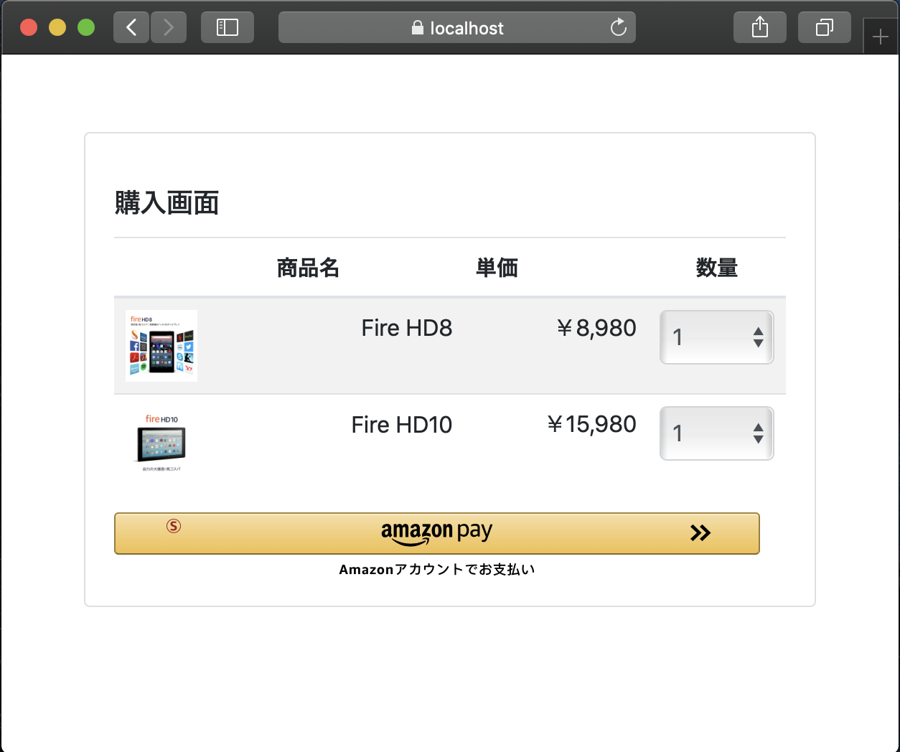

# Amazon Pay cPSP 2ステップ決済 モバイル サンプルアプリ Webアプリケーション側の実装について
GMO Payment Gateway Amazon Pay cPSP の2ステップ決済機能を使用したモバイルサンプルアプリの、Webアプリケーション側の実装です。

## 動作環境
nodejs: v16.20.2 以上  
※ より新しいバージョンでの動作を推奨します。  
(参考) インストーラー & package managerを使ったインストール:  
  - https://nodejs.org/ja/download/
  - https://nodejs.org/ja/download/package-manager/

## 概要
本Webアプリケーションでは、WebView・Secure WebViewからのrequest受付・画面の出力 及び 画面遷移・GMOPG Amazon Pay cPSP APIの呼出＆2ステップ決済処理等を行っております。  
より詳細な動作については、[android](../androd/README.md)、[ios](../ios/README.md)側の説明や、コードをご参照下さい。

# server側のインストール

## プロジェクトの準備
本プロジェクトの「nodejs」ディレクトリの下が、こちらのWebアプリケーションのプロジェクトになります。  

## GMOPG管理画面での設定
GMOPG管理画面にて、Amazon Pay cPSP サービスの設定を行い、必要な認証情報を取得してください。  
詳細な設定方法については、[GMOPG Amazon Pay cPSP ドキュメント](https://docs.mul-pay.jp/exsearch/amazonpay-cpsp/overview)をご参照ください。

nodejs/keys/template ディレクトリ下の設定ファイルを参考に、取得した認証情報を適切に設定してください。

## Webサーバーのhttps設定
[こちら](./ssl/README.md)のコマンドを実行し、https通信用の鍵と証明書を作成します。

## 依存モジュールのインストール
本ディレクトリにて、下記のコマンドを実行して依存モジュールをインストールします。
```sh
npm i
```

## サーバーの起動
本ディレクトリにて、下記コマンドを実行します。
```sh
node app.js
```

### browserでのテスト
[https://localhost:3443/sample/cart](https://localhost:3443/sample/cart) にアクセスします。セキュリティの警告を無視してすすめると、下記画面が表示されます。


本サンプルアプリはPC/Mobile上のブラウザでも動作しますので、アプリの動作の確認や挙動の理解にご活用ください。
